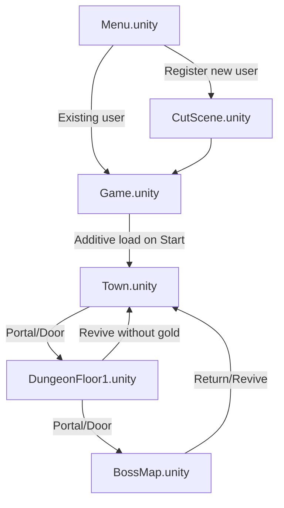
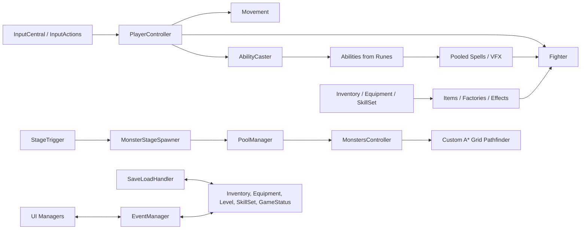
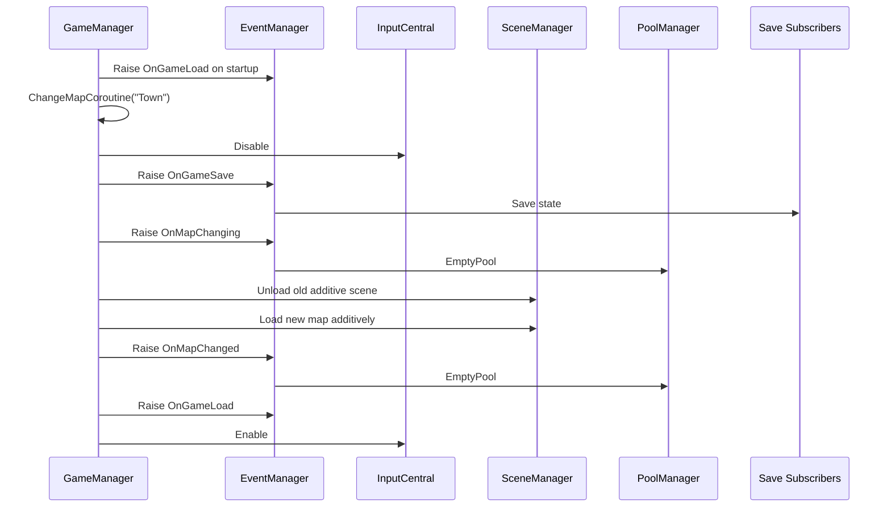
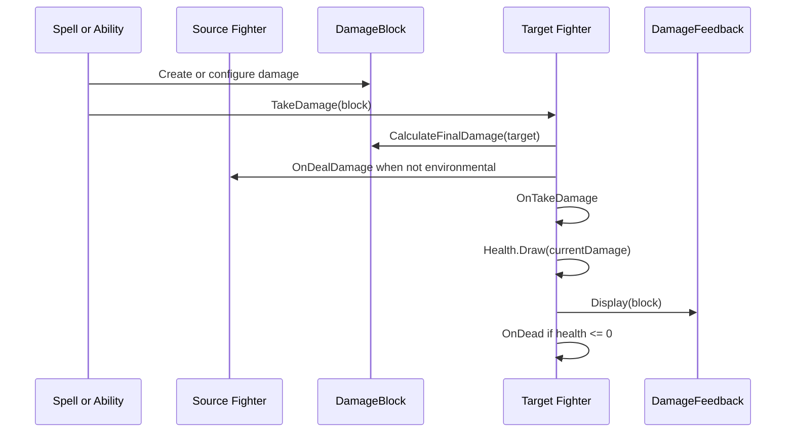
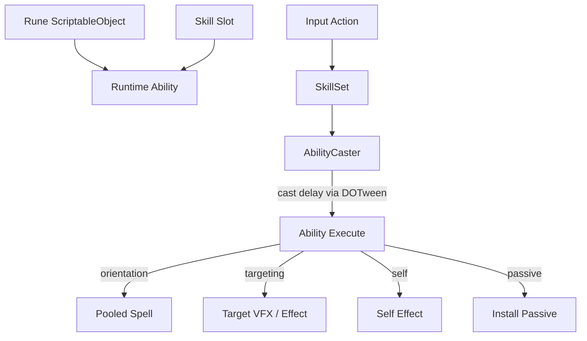
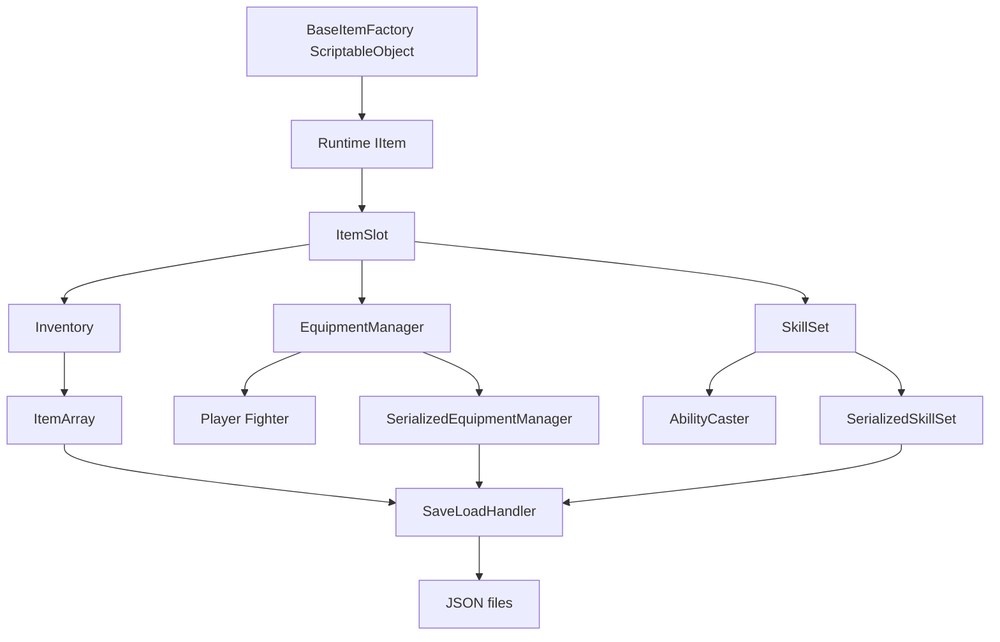
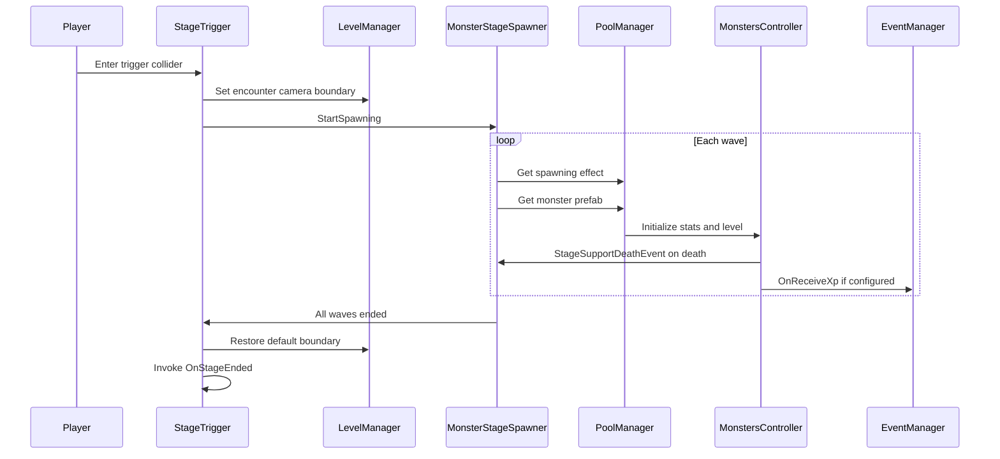
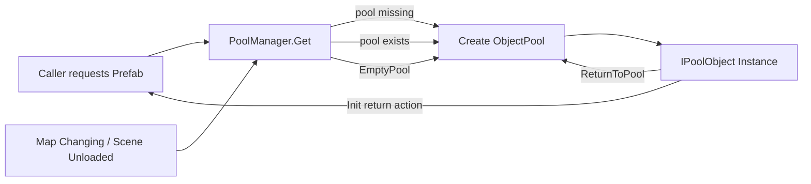
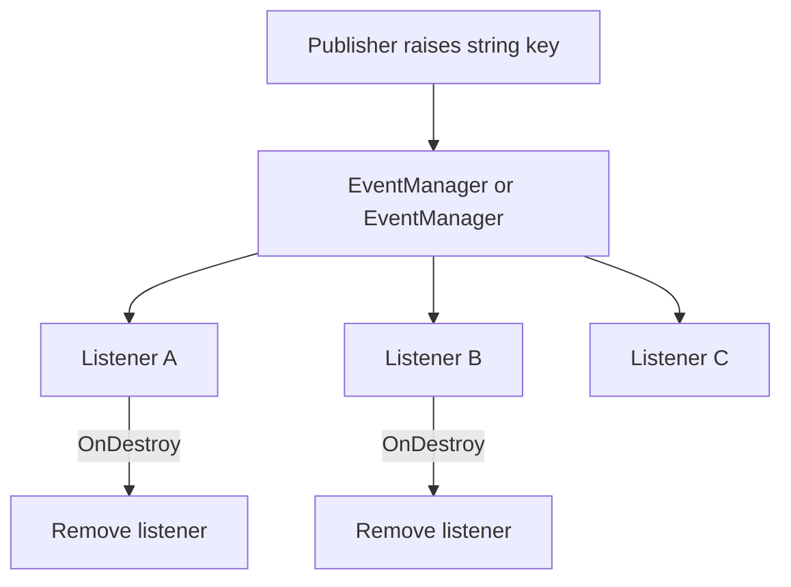
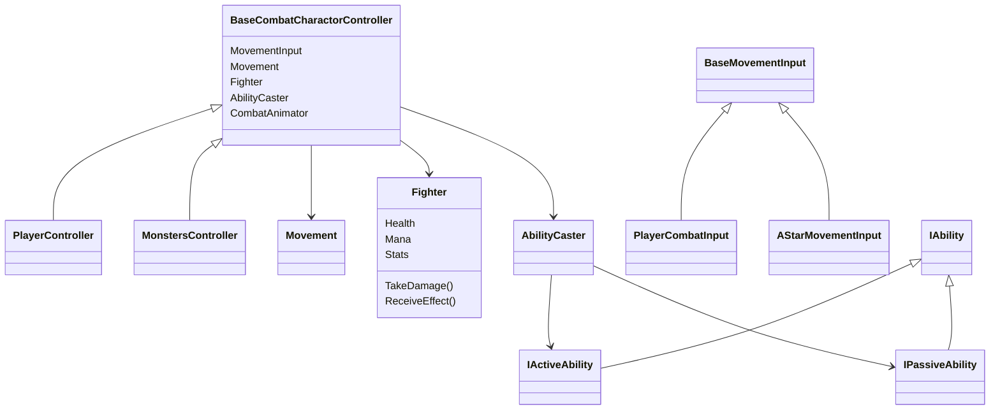

# Night Realm Developer Guide

This document is a combined Game Design Document and engineering architecture guide for the current Unity 2D top-down RPG codebase. It is written for game developers who need to understand the implemented game, maintain it, and extend it without losing the existing design intent.

Source of truth used for this document:

- Unity version: `6000.3.10f1`, from `ProjectSettings/ProjectVersion.txt`.
- Build scenes: `Menu`, `Game`, `Town`, `DungeonFloor1`, `BossMap`, `CutScene`, from `ProjectSettings/EditorBuildSettings.asset`.
- Runtime packages: Unity 2D suite, URP, Cinemachine, Input System, TextMesh Pro, Timeline, UGUI, DOTween. The old A* Pathfinding Project asset may still exist in the repository, but gameplay AI now uses the project-owned A* implementation under `Assets/Scripts/Pathfinding`.
- Game-owned C# code: `Assets/Scripts`, excluding generated `Assets/Scripts/InputSystem/InputActions.cs`.

Third-party and generated source such as DOTween modules, Unity-generated `InputActions.cs`, the unused legacy A* package, and imported demo character scripts are summarized by integration role instead of explained line by line.

## 1. Developer-Facing GDD

### 1.1 Game Overview

The project is a Unity 2D top-down RPG named `Night Realm` in code strings. The current game structure is a hub-and-dungeon flow:

- The player starts from a menu or registration flow.
- The persistent `Game` scene initializes global systems and loads a gameplay map additively.
- `Town` acts as the starting hub and safe state.
- `DungeonFloor1` contains staged enemy encounters.
- `BossMap` contains boss-specific combat behavior and UI.
- `CutScene` is used before entering the main game for new-user flow.

The implemented design is a combat-focused RPG with:

- Character stats and stat scaling.
- Player health, mana, movement, and death/revive loop.
- Runes that become active or passive abilities.
- Equipment, consumables, inventory, shop, chest storage, and rewards.
- Enemy spawning, custom A* pathfinding movement, melee/ranged combat behavior, and boss abilities.
- Event-driven save/load and UI communication.

### 1.2 Core Loop

The current loop is:

1. Select or register a user in the menu.
2. Load the persistent `Game` scene.
3. `GameManager` loads persistent state and additively loads `Town`.
4. The player moves, interacts with NPCs, shops, storage, portals, and tutorial UI.
5. The player enters combat maps through portals or doors.
6. Stage triggers lock camera boundaries and spawn monster waves.
7. Killing monsters grants XP and potential rewards through existing item systems.
8. Player upgrades through levels, runes, equipment, and consumables.
9. Death disables input, subtracts level through event listeners, and asks for revive payment or returns the player to `Town`.
10. Map changes and quit flow raise save events.

### 1.3 Controls And Input

The project uses Unity's new Input System. `InputCentral` owns the generated `InputActions` singleton and exposes global enable/disable helpers. Gameplay input is split into:

- `PlayerMove`: movement vector read by `PlayerCombatInput`.
- `PlayerAbilityTrigger`: ability input read by `SkillSet`.
- `Interact`: interact button used by `PlayerInteract`.

The code also reads mouse position directly in `PlayerController.Update` to update `AbilityCaster.LookDirection`.

Implementation note: input is globally disabled during loading screens, tutorial guide display, dialogue, confirmation panels, messages, and death handling. New modal UI should follow the same pattern or move to a stacked input-lock service to avoid re-enabling input while another modal is still open.

### 1.4 Player Progression

Progression currently exists in four layers:

- Level progression: `PlayerLevelSystem` listens for XP events and death events.
- Stats: `BaseStatData`, `BaseStats`, `CharactorStat`, and `StatModifier` define base and scaling stats.
- Runes and abilities: rune ScriptableObjects become active/passive abilities through skill slots.
- Equipment and consumables: item factories create runtime items that apply effects or can be serialized.

The current progression model is implemented as code and ScriptableObject content rather than a central progression database. This is flexible for a small game, but future balancing work should add spreadsheet/export tooling or ScriptableObject validation.

### 1.5 Combat Design

Combat is centered on `Fighter`:

- `Fighter.Health` and `Fighter.Mana` are `ResourceBlock` values.
- `Fighter.Stats` is a `CharactorStat` collection.
- `Fighter.TakeDamage` calculates final damage, raises deal/take damage events, reduces health, and displays feedback.
- Effects implement `IEffect` and are installed on a target fighter.
- Death is detected through `Health.OnValueChange`.

Damage supports multiple states and types through `DamageBlock`, including physical, magical, critical, blocked, missed, and environmental damage.

Abilities generally do not directly mutate UI or game state. They are cast through `AbilityCaster`, instantiate pooled VFX/spells through `PoolManager`, and apply combat effects through `Fighter.ReceiveEffect` or spell collision.

### 1.6 Runes And Abilities

Runes are ScriptableObject items. They act as player-facing inventory items and as factories/configuration for abilities.

Current rune types:

- `OrientationRune`: active ability released in the caster look direction.
- `TargetingRune`: active ability released toward a selected target.
- `SelfActiveRune`: active ability applied to self.
- `PassiveRune`: passive ability installed on an `AbilityCaster`.

Current ability wrappers:

- `OrientationAbility`
- `TargetingAbility`
- `SelfActiveAbility`
- `PassiveAbility`

The split between rune data and runtime ability instances is a strong pattern for designer-authored content. Future work should standardize naming, validation, and descriptions so all rune assets expose cost, target type, cast delay, VFX, and effects consistently.

### 1.7 Items, Inventory, Equipment, Shop, And Storage

The item model is interface-driven:

- `IItem` is the base serializable item contract.
- `IStackableItem` adds stack merging.
- `IUsableItem` adds use behavior.
- `Equipment` applies stat/effect factories when equipped.
- `ConsumableItem` applies an effect and optional VFX when used.

The UI slot model uses generic slot classes:

- `ItemSlot<T>` contains shared pointer, drag, drop, and item assignment logic.
- `InventorySlot`, `EquipmentSlot`, `ConsumableSlot`, `ActiveAbilitySlot`, `PassiveAbilitySlot`, `ShopSlot`, `ChestSlot`, and `RewardSlot` specialize slot behavior through type constraints and event emission.

Inventory, equipment, skill set, chest storage, and shop behavior communicate mostly through `EventManager` string keys. This decouples UI widgets, but future work should replace string event names with constants or typed channels to avoid runtime-only typo failures.

### 1.8 Enemies, Stages, And Bosses

Enemy characters use the same base combat controller as the player:

- `MonstersController` inherits `BaseCombatCharactorController` and implements pooling.
- `AStarMovementInput` turns custom grid A* paths into movement input vectors.
- `MonstersAI`, `BossMinionAI`, `MeleeAICombatBehaviour`, and `RangeAICombatBehaviour` implement enemy decision behavior.

Stage encounters use:

- `StageTrigger` to start an encounter when the player enters a trigger.
- `MonsterStageSpawner` to spawn configured waves.
- `LevelManager` and `CameraManager` to lock camera bounds during encounters.

Boss combat is implemented separately under `Assets/Scripts/Charactor/Boss` and additional boss spell scripts under the monster art asset folder. Boss behavior is workflow-driven through `BossAICombatHandler`.

### 1.9 Maps And Scene Design

Scene responsibility:

- `Menu`: user selection, registration, and entry into `Game` or `CutScene`.
- `CutScene`: intro sequence and transition to `Game`.
- `Game`: persistent manager scene, loading UI, player and global UI references.
- `Town`: hub interactions, shops, storage, doors, NPCs, safe state.
- `DungeonFloor1`: staged combat map.
- `BossMap`: boss encounter map.

Map transitions should always go through `GameManager.ChangeMap` or interactables that call it. Direct scene loads from gameplay scenes would bypass save/load and pool cleanup events.

### 1.10 UI/UX

Implemented UI systems include:

- Confirmation modal.
- Dialogue panel.
- Casting bar.
- Floating text, hit VFX, health bars, monster info.
- Inventory, chest, shop, equipment, skill slots, tooltips, option boxes.
- Mail/message UI.
- Main menu selector and register panels.
- Stat panels and player status widgets.

Most UI code is MonoBehaviour-driven and event-driven. It assumes inspector-wired references. Future work should add prefab validation tests or editor scripts because null references will otherwise surface only at runtime.

### 1.11 Audio

Audio is centralized around `AudioManager`, `AudioAsset`, and pooled audio sources. Audio assets live under `Assets/Resources/Audio/AudioAssets`, and an audio mixer is loaded from `Resources`.

Current design uses:

- ScriptableObject `AudioAsset` content.
- Pooled `PoolingAudioSource` objects.
- UI helper scripts for click and pointer sounds.

Future work should define audio categories, volume persistence, and mixer snapshot rules.

### 1.12 Save And Load

Save/load is event-driven:

- `GameManager` raises `OnGameSave` before map changes and quit.
- `GameManager` raises `OnGameLoad` during startup and after map changes.
- Inventory, equipment, skill set, player level, game status, and storage subscribe to these events.
- `SaveLoadHandler` writes JSON through `FileNameData.GetFullPath`.

Serialization uses two paths:

- Plain Unity `JsonUtility` for simple data classes.
- Wrapped custom serialization for polymorphic items/effects/resources.

Future work should add version fields, migration logic, and save corruption reporting.

### 1.13 Content Pipeline

Designer-authored content is primarily stored as Unity assets:

- Stats: `Assets/Resources/Stats`.
- Runes: `Assets/Resources/Runes`.
- Rune factories: `Assets/Resources/Runes/Factories`.
- Effects: `Assets/Resources/Effects`.
- Equipment: `Assets/Resources/Equipments`.
- Consumables: `Assets/Resources/ConsumableItems`.
- Audio: `Assets/Resources/Audio/AudioAssets`.

Because runtime serialization relies on `Resources.Load`, asset names and paths are part of the save contract. Renaming assets can break existing saves unless migration is added.

## 2. Runtime Architecture

### 2.1 Scene Flow

`Game` is the runtime root. Gameplay maps are loaded additively and swapped by `GameManager.ChangeMapCoroutine`.

### 2.2 High-Level Architecture

### 2.3 GameManager Sequence

### 2.4 Combat Damage And Effects

### 2.5 Ability And Rune Flow

### 2.6 Inventory, Equipment, And Serialization

### 2.7 Stage And Monster Spawning

### 2.8 Object Pooling

### 2.9 EventManager Flow

Important event keys seen in project code:

- `OnGameSave`
- `OnGameLoad`
- `OnMapChanging`
- `OnMapChanged`
- `OnPlayerDead`
- `OnReceiveXp`
- `SendSystemMessage`
- `OnUserSelected`
- `OnTryAddItemToInventory`
- `TryEquipEquipment`
- `TryEquipActiveAbility`
- `TryEquipPassiveAbility`
- `OnSlotPointerEnter`, `OnSlotPointerExit`, `OnSlotBeginDrag`, `OnSlotDrop`, `OnSlotEndDrag`

### 2.10 Core Class Relationships

## 3. Engineering Design Notes

### 3.1 Design Patterns Present

- Singleton-like global reference: `GlobalReference<T>`, `PlayerController.Instance`, static managers.
- Event bus: `EventManager` and `EventManager<T>` decouple senders from subscribers.
- Factory: item, equipment, consumable, rune, and effect factories create runtime objects from ScriptableObject data.
- Object pool: `PoolManager`, `ObjectPool`, `PoolObject`, and `IPoolObject` reuse projectiles, VFX, UI feedback, monsters, and audio sources.
- Strategy-like behavior: effects implement `IEffect`, abilities implement `IAbility` variants, and AI combat behavior is split by melee/ranged/boss behavior.
- Template method: `BaseCombatCharactorController` provides shared wiring and overridable hooks for player and monsters.
- Adapter/wrapper: `AStarMovementInput` wraps custom A* path results into this project's `BaseMovementInput` vector model.
- Data-driven content: ScriptableObjects hold stats, runes, effects, equipment, consumables, colors, and audio assets.

### 3.2 OOP And SOLID Review

Strengths:

- The project uses interfaces for item, effect, ability, interactable, and pool contracts.
- Player and monster controllers reuse shared combat/movement/animation wiring.
- ScriptableObject factories separate authored content from runtime object instances.
- Poolable objects share a clear `IPoolObject` contract.

Risks:

- Static managers and string-keyed events hide dependencies and make refactoring risky.
- Some classes combine UI, persistence, and gameplay responsibilities, especially item managers.
- Several names contain typos such as `Charactor`, `Intance`, `Fatory`, `Recorver`, `Dubarity`, and `EnvinronmentalDamage`.
- Save/load catches exceptions broadly, which hides corruption and migration problems.
- `Resources.Load` paths are save-contract data, so asset renames are dangerous.
- Modal input locking is not reference-counted; one UI can re-enable input while another UI still expects it disabled.

Recommended direction:

- Keep the current architecture for v1 stability.
- Add constants or typed event channel wrappers for all event keys.
- Add save versioning before content renames.
- Add editor validation for ScriptableObject assets and prefab references.
- Gradually move global static dependencies behind service facades where testability matters.

### 3.3 Advanced Unity/C# Techniques Present

- Generic event manager with payload support.
- Generic item slots using `ItemSlot<T>`.
- Generic singleton-like global references.
- ScriptableObject factories for polymorphic content.
- Runtime polymorphic serialization through wrapped JSON.
- DOTween-driven async visual progress.
- Additive scene loading with persistent manager scene.
- Pooled MonoBehaviours implementing custom return callbacks.
- Project-owned grid A* pathfinding through `AStarMovementInput`, `AStarPathfinder`, `AStarGrid`, and `AStarNode`.
- Extension methods for coroutine wait helpers, rich text, vector helpers, and probability checks.

## 4. Implementation Roadmap

### 4.1 Short-Term Stabilization

- Add central constants for event keys to remove duplicated strings.
- Add editor validation for required serialized fields in managers, UI widgets, interactables, and combat prefabs.
- Add save version fields and readable error reporting in `SaveLoadHandler`.
- Add a reference-counted input lock service to replace direct `InputCentral.Disable` and `InputCentral.Enable` calls from modals.
- Add missing null checks around critical singleton/global references.

### 4.2 Gameplay Extensions

- Add new rune content using existing `Rune` and `Ability` patterns.
- Add encounter rewards to `MonsterStageSpawner` or `StageTrigger`.
- Add boss phase data so `BossAICombatHandler` can be tuned without code changes.
- Add map progression flags to `GameStatus`.
- Add quest state and NPC dialogue branching beyond current options.

### 4.3 Tooling

- Add a content validation editor window for runes, effects, equipment, audio assets, and consumables.
- Add a save inspector for development builds.
- Add diagram generation or documentation checks for public event keys and save files.
- Add test scenes or play mode tests for combat, item drag/drop, map transitions, and save/load.

## 5. Codebase Explanation Appendix

This appendix covers game-owned custom code under `Assets/Scripts`, excluding generated `InputActions.cs`. Each entry explains the file at line-level intent: imports establish dependencies, serialized fields are inspector configuration, Unity lifecycle methods wire and unwire runtime behavior, public methods are integration points, private methods implement local control flow, and nested serialized classes define persistence payloads.

For implementation work, read each file with this line-level rule:

- `using` lines: dependency declaration and namespace access.
- `namespace` lines: module ownership and serialization type identity.
- class/interface/enum declaration: public contract and Unity/component role.
- `[SerializeField]` and `[field: SerializeField]` lines: inspector-owned data and prefab wiring.
- fields/properties: runtime state, cached references, and exposed read-only state.
- `Awake`, `Start`, `OnEnable`, `Update`, `FixedUpdate`, `OnDisable`, `OnDestroy`: Unity lifecycle integration.
- event subscription lines: dependency on another system's notification.
- event removal lines: memory-safety and duplicate-callback prevention.
- `Resources.Load` lines: runtime asset lookup and save-contract dependency.
- `PoolManager.Get` lines: pooled allocation and return-to-pool lifecycle.
- `SaveLoadHandler` lines: persistent state boundary.
- `EventManager.RaiseEvent` lines: cross-system side effects.
- coroutine/yield lines: delayed or frame-based control flow.

### 5.1 AudioManager

| File | Line-level explanation |
| --- | --- |
| `AudioAsset.cs` | Declares a ScriptableObject audio definition. Attribute lines expose it in Unity's asset menu. Serialized fields define clip, mixer group, volume/pitch style data. Enum lines define target mixer categories. Property lines expose read-only audio metadata to `AudioManager`. |
| `AudioManager.cs` | Static audio service. Resource-loading lines acquire the mixer and source helper prefab. Public play methods are API entry points for music/SFX/UI sounds. Pool access lines request reusable `PoolingAudioSource` instances. Mixer lines route clips to the requested audio group. Null fallback lines prevent hard crashes when audio helpers are missing. |
| `AudioPlayerHelper.cs` | MonoBehaviour bridge for inspector-driven audio playback. Serialized `AudioAsset` fields identify clips. Public methods are button/animation event hooks that forward playback to `AudioManager`. |
| `AudioSettingForUI.cs` | UI script for mixer volume controls. Serialized fields connect sliders/toggles. Lifecycle lines initialize UI state. Event handler lines write user choices to the audio mixer. |
| `NullSource.cs` | Null-object pool source. Inherits pooled audio behavior but safely handles missing clips or unavailable playback. Lines exist to satisfy `PoolingAudioSource` contract without side effects. |
| `PoolingAudioSource.cs` | Poolable audio source wrapper. Serialized/cached source lines hold Unity `AudioSource`. Play lines configure clip, mixer, volume, and return timing. Coroutine or callback lines return the object to the pool after playback. |

### 5.2 Character Core

| File | Line-level explanation |
| --- | --- |
| `BaseCombatCharactorController.cs` | Shared controller for combat actors. Serialized property lines require movement input, movement, fighter, ability caster, and animator references. `Awake` lines subscribe movement/combat/casting events. Handler methods translate movement into animation, damage into hurt animation and cast collapse, death into movement blocking, and cast start into casting bar UI. `OnDestroy` lines unsubscribe defensively. |
| `BaseMovementInput.cs` | Abstract input source. Field/property lines store an input vector and raise change events. Derived classes set the vector from player input or AI pathfinding. |
| `CombatAnimator.cs` | Extends movement animation with combat-specific triggers. Lines wrap animator parameters for hurt/death/casting/combat animation events. |
| `Movement.cs` | Applies movement vector to transform or Rigidbody2D. Serialized fields define speed and blocking state. Update/fixed update lines move only when not blocked. State lines raise start/stop movement events and clear movement state for respawn/pooling. |
| `MovementAnimator.cs` | Owns movement animation state. Serialized animator lines bind Unity animator. Direction/moving methods set animator parameters based on movement input. Clear-state lines reset animation after death, respawn, or pooling. |

### 5.3 Boss

| File | Line-level explanation |
| --- | --- |
| `BossAICombatHandler.cs` | Boss ability workflow controller. Serialized handler lists configure named boss abilities and timing. Nested class lines define ability handlers and workflow nodes. Enum lines identify boss ability names. Runtime lines select abilities, trigger casts, wait for completion, and clear pools during transitions. |
| `BossAIController.cs` | Boss movement and behavior coordinator. Serialized lines bind movement/combat dependencies. Lifecycle and update lines drive boss decisions, target tracking, and behavior handoff to combat handler. |
| `BossUI.cs` | Boss-specific UI binding. Serialized fields bind health/name UI. Lifecycle lines subscribe to boss fighter health/death events. Update lines refresh visible boss status. |

### 5.4 Monsters

| File | Line-level explanation |
| --- | --- |
| `BaseAICombatBehaviour.cs` | Abstract base for enemy combat decisions. Serialized fields define owner, target, timing, and attack constraints. Public methods start/stop behavior. Protected methods are implemented by melee/ranged variants. |
| `BossMinionAI.cs` | Specialized pathfinding movement AI for boss-spawned minions. Inherits `AStarMovementInput`; lines tune target acquisition and minion movement behavior. |
| `MeleeAICombatBehaviour.cs` | Melee enemy attack behavior. Distance checks decide when to move or attack. Attack lines create damage/effect behavior against the player. Cooldown lines throttle repeated attacks. |
| `MonstersAI.cs` | General enemy AI that follows the player using A* pathing. Lifecycle lines acquire target references. Update/coroutine lines call `MoveTo` or stop based on combat range and state. |
| `MonstersController.cs` | Poolable monster actor. Initialize lines clear old effects/bonuses, apply stat data, scale by level, fill resources, reset movement/animation, and attach world-space UI. Death lines notify stage spawners and XP listeners. Pooling lines store return callbacks and either return or destroy. |
| `MonsterSpawner.cs` | Direct monster spawner component. Serialized fields describe prefab/stat/count/timing. Runtime lines request monsters from the pool, position them, and initialize combat data. |
| `RangeAICombatBehaviour.cs` | Ranged enemy attack behavior. Range checks and line-of-sight style logic decide when to fire. Pool/spell lines instantiate ranged attacks. Cooldown lines throttle fire rate. |
| `SeekerMovingAI.cs` | Obsolete compatibility wrapper that now inherits `AStarMovementInput` and contains no third-party `Pathfinding` dependency. Existing code should inherit `AStarMovementInput` directly. |

### 5.4.1 Project-Owned Pathfinding

| File | Line-level explanation |
| --- | --- |
| `AStarGrid.cs` | Converts between world positions and local grid cells. Constructor lines configure origin, cell size, obstacle radius, search bounds, and obstacle mask. Walkability lines use `Physics2D.OverlapCircle` against `LayerMaskHelper.ObstacleMask`. Line-of-sight lines use `Physics2D.CircleCast` for direct-path and smoothing checks. |
| `AStarNode.cs` | Lightweight node model for A*. Lines store cell coordinate, movement cost, heuristic cost, parent node, and computed total cost. |
| `AStarPathfinder.cs` | Pure C# A* search. Direction arrays define cardinal and diagonal neighbors. `FindPath` converts world positions to cells, finds nearest walkable target, evaluates open/closed sets, prevents diagonal corner cutting, and reconstructs world waypoints. `SmoothPath` removes unnecessary intermediate waypoints when line-of-sight is clear. |
| `AStarMovementInput.cs` | Runtime movement bridge. Serialized fields tune cell size, search range, visited-node cap, obstacle radius, waypoint threshold, repath cooldown, diagonal movement, smoothing, and gizmos. `MoveTo` requests a path and falls back to direct line-of-sight. Coroutine lines walk waypoints and write `InputVector` for the existing `Movement` component. |

### 5.5 Player

| File | Line-level explanation |
| --- | --- |
| `PlayerCombatInput.cs` | Player movement input source. `Awake` caches global input actions. `Update` reads `PlayerMove.Move` as `Vector2` and writes it to `InputVector`. |
| `PlayerController.cs` | Player singleton and death/revive controller. Serialized stat data defines baseline player stats. Lifecycle lines enforce one instance, cache camera, and revive on enable. Update line maps mouse world position to ability look direction. Death lines disable input, raise `OnPlayerDead`, and ask for revive. Revive lines restore stats/resources, clear movement and animation, and optionally change map. |
| `PlayerLevelSystem.cs` | XP and level persistence. Serialized level data defines progression thresholds. Event lines save/load, receive XP, and subtract level on death. Level-up lines grant stat modifiers, play VFX, and notify UI/audio. Save lines serialize level state. |

### 5.6 CutScene

| File | Line-level explanation |
| --- | --- |
| `CutSceneController.cs` | Cutscene transition controller. Timeline or animation callback lines end the intro, kill tweens, and load `Game`. |
| `MonsterRandomMove.cs` | Simple cutscene movement helper. Serialized bounds/timing fields configure wandering. Coroutine/update lines choose random destinations and move decorative monsters. |

### 5.7 Extension

| File | Line-level explanation |
| --- | --- |
| `CoroutineHelper.cs` | Static cache/helper for coroutine wait objects. Lines provide common waits such as fixed update or timed waits to reduce repeated allocations. |
| `Extension.cs` | General extension methods. Rich text lines format UI strings. Wait lines wrap seconds into yield instructions. Vector helper lines convert or clamp vector data. Chance helper lines centralize probability checks. |
| `LayerMaskHelper.cs` | Static access to project layer masks. Lines define masks for obstacles, interactables, fighters, or combat filtering so gameplay scripts do not duplicate layer names. |

### 5.8 Game

| File | Line-level explanation |
| --- | --- |
| `EventManager.cs` | Static event bus. Dictionary lines store event key to callback lists. Add/remove lines maintain subscriber lists. Raise lines invoke callbacks. Generic variant lines provide typed payload events. This file is central to save/load, item UI, XP, messages, map changes, and menu selection. |
| `Game.cs` | Static quit facade. `Quit` opens a confirmation panel. `QuitImediately` raises `OnGameSave`, stops play mode in editor, or quits the built application. |
| `GameManager.cs` | Persistent runtime manager. Static properties hold current map, pause state, and player gold. Nested `GameStatus` defines saved global state. `Awake` wires save/load events. `Start` sends welcome message, loads saved data, loads `Town`, and shows guide once. `Update` toggles pause with `P`. Save/load methods persist gold/tutorial state. Map coroutine validates scene, shows loading UI, disables input, saves, unloads old map, loads new map additively, raises map events, reloads systems, and re-enables input. |
| `Guide.cs` | First-time tutorial overlay. Pointer/click lines advance or close guide UI. Completion line re-enables input. |
| `PlayerSpawnPoint.cs` | Scene marker for player positioning. Lines expose transform data so map load code can place the player at a spawn point. |

### 5.9 Combat

| File | Line-level explanation |
| --- | --- |
| `CombatHelper.cs` | Static combat utility. Lines calculate target filtering, hit decisions, random chance, or shared damage helper behavior used by spells/effects. |
| `DamageBlock.cs` | Damage payload. Enum lines define damage state and type. Field/property lines store source, target, raw damage, current damage, critical/block/miss state. Calculation lines apply target stats and chance rules to produce final damage. |
| `Fighter.cs` | Core combat component. Serialized lines bind hitbox and movement. Resource/stat lines hold health, mana, and stats. Event lines expose damage and death notifications. `Awake` wires stat changes to resource capacities and speed. Effect methods install and clean effects. `TakeDamage` ignores invisible/dead targets, calculates damage, raises events, reduces health, and displays feedback. Death check line raises `OnDead`. |
| `LevelSystem.cs` | General level math helper. Lines store level, XP, thresholds, and methods for adding XP, detecting level-up, and exposing current progression. |

### 5.10 Ability

| File | Line-level explanation |
| --- | --- |
| `Ability.cs` | Generic ability base. Type parameter lines bind ability to rune type. Fields store rune data and owner/caster context. Shared description/serialization lines support item UI and saving. |
| `AbilityCaster.cs` | Runtime caster. Field lines store passive abilities, owner fighter, target, casting state, look direction, and DOTween tweener. `LookDirection` converts world point into vector from owner. `CastHelper` raises cast start, starts DOTween progress, and invokes skill action on complete. `CollapseCasting` cancels active casts. Passive add/remove lines install and clean passive abilities. |
| `ActiveAbility.cs` | Generic active ability base. Lines implement common active ability contract, cast delay, target behavior, and use/cast entrypoints shared by orientation, targeting, and self abilities. |
| `IAbility.cs` | Interface joining ability and item contracts. Lines require ability objects to be usable in the item/slot system. |
| `IActiveAbility.cs` | Active ability interface. Lines define cast/use behavior expected by skill slots and ability triggering. |
| `IPassiveAbility.cs` | Passive ability interface. Lines define install and cleanup behavior for long-lived passive effects. |
| `OrientationAbility.cs` | Directional active ability. Lines serialize rune references, call caster delay, spawn configured spell prefab, position it at caster, and release it along look direction. Nested serialized class preserves ability in save data. |
| `PassiveAbility.cs` | Passive runtime ability. Install lines apply passive rune effects to caster/owner. Cleanup lines remove installed effects. Serialization lines preserve learned/equipped passive runes. |
| `Respond.cs` | Enum defining ability response/result status. Lines are used to communicate success, failure, target invalidity, or other ability outcomes. |
| `SelfActiveAbility.cs` | Self-targeting active ability. Lines cast through `AbilityCaster`, play VFX, apply effects to owner, and serialize the selected rune. |
| `TargetingAbility.cs` | Targeted active ability. Lines validate current target, cast with delay, play activation VFX, and apply rune effects toward `AbilityCaster.CurrentTarget`. |
| `TargetType.cs` | Enum defining target categories such as self, enemy, ally, or position depending on ability implementation. |

### 5.11 Effects

| File | Line-level explanation |
| --- | --- |
| `EffectInfo.cs` | Designer-facing effect metadata. Enum lines classify effect type. Serialized lines store description fragments and color/category info. Description property lines format colored tooltip text. |
| `IEffect.cs` | Runtime effect contract. Lines require instantiate/apply behavior and cleanup behavior. |
| `BaseEffectAndFactory.cs` | Combines ScriptableObject factory and direct instant effect implementation. Lines allow one asset to both build and apply itself when no separate runtime object is needed. |
| `BaseEffectFactory.cs` | Abstract ScriptableObject factory for effects. Serialized lines expose effect info. Build/serialization lines create runtime effects and save polymorphic references. |
| `BuffEffectFactory.cs` | Permanent stat modifier effect factory. Lines define target stat, bonus type, value, build behavior, install behavior, and cleanup removal. Nested `BuffEffect` applies stat modifiers to a fighter. |
| `DamageEffect.cs` | Instant damage effect. Lines build a `DamageBlock`, configure source/target damage values, and call target `TakeDamage`. |
| `DamageOverTimeEffectFactory.cs` | Duration damage effect. Serialized duration/tick lines configure over-time behavior. Runtime nested effect starts repeated damage ticks and cleans coroutine/state on removal. |
| `DurationBuffEffectFactory.cs` | Timed stat buff/debuff. Lines apply a buff effect, wait for duration, and clean it automatically. |
| `HealEffect.cs` | Instant health recovery effect. Lines calculate healing value and draw negative or recovery amount into target resources. |
| `HealOverTimeEffectFactory.cs` | Duration recovery effect. Lines tick healing repeatedly over configured duration and clean up at end/removal. |
| `RecorverManaEffect.cs` | Instant mana recovery effect. Lines calculate recovery and fill target mana. Name contains typo but behavior is mana recovery. |
| `StatBasedValue.cs` | Value calculation helper. Serialized fields define flat/stat-scaled values. Runtime lines calculate final numeric value from a fighter's stats. |

### 5.12 Runes

| File | Line-level explanation |
| --- | --- |
| `ActiveRune.cs` | Abstract active rune data. Serialized fields define cast delay, cost, target rules, VFX, spell prefab, and effect arrays. Methods create active ability variants and expose item subtypes. |
| `OrientationRune.cs` | ScriptableObject data for directional abilities. Attribute line exposes asset creation. Create ability line returns `OrientationAbility`. |
| `PassiveRune.cs` | ScriptableObject data for passive abilities. Serialized effects define what is installed. Create ability line returns `PassiveAbility`. |
| `Rune.cs` | Base rune item. Serialized fields define name, description, icons, rarity, and learn cost. Description lines include affordable/unaffordable rich text. Serialization line stores resource path. Destroy event line notifies owners. |
| `RuneFactory.cs` | ScriptableObject item factory wrapping a rune reference. `CreateItem` returns the configured rune for shops/rewards/default items. |
| `SelfActiveRune.cs` | ScriptableObject data for self-cast active runes. Create ability line returns `SelfActiveAbility`. |
| `TargetingRune.cs` | ScriptableObject data for target-based active runes. Create ability line returns `TargetingAbility`. |

### 5.13 Spells

| File | Line-level explanation |
| --- | --- |
| `AreaExplosionSpell.cs` | Poolable area spell. Serialized lines define radius, effect, VFX/audio. Activate/collision lines find targets in area and apply effects, then return to pool. |
| `ClearMapSpell.cs` | Large-area spell. Lines iterate valid targets across map/range, apply effects, spawn hit VFX, and return pooled instances. |
| `DirectionalExplosionStrightSpell.cs` | Directional explosive projectile variant. Inherits straight explosion behavior and adjusts direction/spawn setup. |
| `ISpell.cs` | Spell contract extending pool object. Lines define release/initialize behavior required by ability code. |
| `SlashSpell.cs` | Short-range slash spell. Lines position slash relative to caster/look direction, apply overlap damage/effects, and return to pool. |
| `StraightBullet.cs` | Poolable projectile. Serialized speed/lifetime/effects fields configure bullet behavior. Release lines set movement direction. Trigger lines detect hit targets, apply effects, and return to pool. |
| `StraightExplosionBullet.cs` | Projectile with explosion on impact. Lines extend straight bullet, spawn explosion prefab through `PoolManager`, and apply area effects. |
| `SwordTrail.cs` | Poolable melee trail visual/damage object. Lines follow slash timing, apply contact effects, and return to pool. |
| `ZoneDamage.cs` | Persistent or timed damage zone. Lines apply effects to fighters entering or staying in the zone, track duration, and return to pool. |

### 5.14 Stats

| File | Line-level explanation |
| --- | --- |
| `BaseStatData.cs` | ScriptableObject stat asset. Attribute exposes stat data creation. Serialized base and growth lines define level scaling. `LvGrowStat` lines calculate modifiers for a level. |
| `BaseStats.cs` | Base stat container. Lines store initial values by `Stat` enum and expose lookup/modification helpers. |
| `CharactorStat.cs` | Runtime stat collection. Enum defines stat names such as health, mana, attack, defense, move speed, evasion, critical chance, and block chance. Class lines store base values, modifiers, value change events, and indexer access. |
| `StatModifier.cs` | Stat bonus model. Enum defines flat/percent/additive bonus style. Comparable implementation lines order modifiers so stat calculation is deterministic. |

### 5.15 Shared Game Utilities

| File | Line-level explanation |
| --- | --- |
| `CheckBox.cs` | Sealed boolean holder built on `ObjectHolder<bool>`. Lines provide mutable boxed state for event payload patterns. |
| `ColorData.cs` | ScriptableObject color palette. Serialized color lines define UI/combat rarity or feedback colors. |
| `ColorHelper.cs` | Static color lookup. Resource line loads `Data/ColorData`. Helper lines return colors for rarity/effect text. |
| `FollowTransform.cs` | Utility component that follows another transform. Serialized target/offset lines configure following. Update lines copy target position with offset. |
| `GlobalReference.cs` | Generic MonoBehaviour global reference. `Awake` line stores current instance. Static `Instance` line exposes it. This pattern is used by `GameManager`, `CameraManager`, `ChestStorage`, `CastingBarManager`, `MailBox`, and `MonsterWorldSpaceUIManager`. |
| `ObjectHolder.cs` | Generic boxed value holder. Lines store and expose a mutable value, commonly for event request/response patterns. |
| `ResourceBlock.cs` | Health/mana-style resource. Lines store current and capacity values, clamp changes, raise value change events, and provide fill/draw methods. |
| `SetUpIntance.cs` | Setup helper for singleton/global instances. Lines initialize configured objects or ensure scene setup at runtime. Name contains typo. |

### 5.16 InputSystem

| File | Line-level explanation |
| --- | --- |
| `InputCentral.cs` | Static wrapper around generated `InputActions`. Lazy property creates the action asset. Enable/disable methods globally toggle all input or specific action maps. |
| `InputActions.cs` | Generated by Unity from `InputActions.inputactions`; summarized only. Do not hand-edit. Project code depends on action maps `PlayerMove`, `PlayerAbilityTrigger`, and `Interact`. |

### 5.17 Interactable

| File | Line-level explanation |
| --- | --- |
| `BaseIndicator.cs` | Abstract indicator UI/visual component. Lines define show/hide behavior for interactable prompts. |
| `BaseInteractable.cs` | Abstract MonoBehaviour implementing `IInteractable`. Serialized indicator/message fields define prompt behavior. Trigger/assignment lines cooperate with `PlayerInteract`. |
| `Door.cs` | Door behavior. Lines open/close or enable transition based on interaction/collision. |
| `IInteractable.cs` | Contract for objects the player can interact with. Lines define interaction and assignment methods. |
| `LightRuneIndicator.cs` | Specialized indicator for rune/light interaction. Lines control visual activation state. |
| `LootChest.cs` | Chest reward interactable. Lines expose rewards, open state, and transfer items to inventory/reward slots. |
| `PlayerInteract.cs` | Player interaction scanner/controller. Trigger lines assign and unassign current interactable. Input callback line calls `Interact` on current target. Generic helper lines enforce `MonoBehaviour, IInteractable` constraints. |
| `Portal.cs` | Map-transition interactable. Serialized `mapName` and message lines configure destination. `Interact` opens confirmation and calls `GameManager.ChangeMap`. |
| `SetActiveGameObjectOIndicator.cs` | Indicator that toggles GameObject active state. Lines implement show/hide by setting configured object active/inactive. Name contains typo. |
| `SpikeTrap.cs` | Environmental damage trap. Trigger lines apply environmental damage/effects to entering fighters. |
| `TownChest.cs` | Persistent town storage interactable. Event lines save/load storage. Interaction lines open chest UI. Serialization lines store item array under a chest-specific save file. |
| `TownDoor.cs` | Town-specific door/transition interactable. Lines likely route between town and combat maps through configured destination behavior. |
| `DialogueObject.cs` | Serializable dialogue data. Lines define dialogue text and options. `Option` lines define display text and response action data. |
| `DialoguePanel.cs` | Dialogue UI. Pointer/click lines advance dialogue. Input lock lines disable/enable gameplay during conversation. Option lines render player choices. |
| `NPC.cs` | Base NPC interactable. Serialized dialogue lines define what the NPC says. Interaction line opens `DialoguePanel`. |
| `ShopKeeper.cs` | Shop NPC/helper. Lines open shop UI and provide items/prices to `ItemShop`. |

### 5.18 IOSystem

| File | Line-level explanation |
| --- | --- |
| `FileNameData.cs` | Save path and resource-path constants. Lines combine current user/profile with persistent data paths. Event/listener lines update current user selection. |
| `ISerializable.cs` | Project serialization contract. Lines require conversion to wrapped JSON or serialized object payload. |
| `JsonHelper.cs` | Polymorphic serialization helper. Enum lines define serialized object categories. Wrapper lines store type and JSON. Conversion lines map wrapped JSON back to runtime object types. |
| `SaveLoadHandler.cs` | File IO boundary. Save lines write JSON to computed full paths. Load lines read files, handle missing files, and deserialize simple or wrapped data. Broad catch lines currently hide malformed saves. |
| `SerializedNullObject.cs` | Serialized placeholder for null item/effect references. Lines deserialize to null safely. |
| `SerializedObject.cs` | Abstract base for custom serialized payloads. Lines define deserialize and type-identification contract. |
| `SerializedResourceAsset.cs` | Serialized reference to a Resources asset path. Deserialize line calls `Resources.Load`, making resource paths persistent save data. |

### 5.19 Item Factories

| File | Line-level explanation |
| --- | --- |
| `BaseItemFactory.cs` | Abstract ScriptableObject factory. Lines define `CreateItem` contract for inventory/shop/reward/default-item systems. |
| `BasicEquipmentFactory.cs` | Equipment factory with fixed main stats. Serialized fields configure equipment metadata and effects. Create lines build `Equipment`. |
| `ConsumableItemFactory.cs` | Consumable factory. Serialized lines define item name, icon, rarity, stack amount, effect, and VFX. Create lines return `ConsumableItem`. |
| `EquipmentFactory.cs` | Abstract equipment factory and serialization participant. Lines define equipment name, slot, icon, description, main stat creation, and wrapped serialization. |
| `RandomAmountConsumableFactory.cs` | Consumable factory variant with randomized amount. Lines generate stack/quantity values within configured range. |
| `RandomEquipmentFactory.cs` | Equipment factory variant with randomized effects. Lines select main/sub effects and build randomized `Equipment`. |

### 5.20 Item General UI

| File | Line-level explanation |
| --- | --- |
| `ItemArray.cs` | Serializable wrapper for arrays of `IItem`. Lines convert item arrays to serialized object arrays and deserialize them back. Used by inventory and chest saves. |
| `ItemEventHandler.cs` | Central drag/drop/tooltip coordinator. Event subscription lines listen for slot pointer, drag, drop, and holder request events. Handler lines show tooltips, track current dragged slot, swap slots, and clear drag state. |
| `ItemTooltip.cs` | Tooltip UI renderer. Serialized text/image fields bind UI. Show lines read item name, rarity, icon, and description. Hide lines disable tooltip. |
| `OptionBox.cs` | Context menu for item actions. Lines show/hide selectable item actions based on slot and item type. |
| `SelectOption.cs` | Individual option button. Lines bind label and callback for an option box entry. |
| `SkillBarController.cs` | Skill bar save/load coordinator. Event lines persist skill set state. Serialized skill set fields bind active/passive ability slots. |

### 5.21 Item Runtime Models

| File | Line-level explanation |
| --- | --- |
| `ConsumableItem.cs` | Runtime consumable item. Lines store source factory, stack amount, effect, and icon/name metadata. Use lines apply effect and VFX. Stack lines merge compatible consumables. Nested serialized class stores source and amount. |
| `Equipment.cs` | Runtime equipment item. Constructor lines store source factory and main stats. `AddSubEffect` lines append bonus effects and item subtypes. Description lines build tooltip text. Equip lines build and install effects on fighter. Unequip lines remove applied effects. Nested serialized class stores source/main/sub effect JSON. |
| `IItem.cs` | Base item interface. Lines require name, icon, rarity, item type, subtypes, description, destroy event, and serialization. |
| `IStackableItem.cs` | Stackable item interface. Lines define amount/capacity behavior and helper stacking logic. |
| `ItemRarity.cs` | Enum for item rarity tiers. Lines are used by UI colors and equipment rarity calculation. |
| `IUsableItem.cs` | Usable item interface. Lines add use behavior to base item contract. |

### 5.22 Item Slots

| File | Line-level explanation |
| --- | --- |
| `ActiveAbilitySlot.cs` | Slot for active abilities. Lines constrain item type, bind input trigger, and call ability cast/use through skill set. |
| `BasicAbilitySlot.cs` | Specialized active ability slot for basic attack/default ability behavior. |
| `ChestSlot.cs` | Chest storage slot. Drop/click lines raise inventory transfer events. |
| `ConsumableSlot.cs` | Slot for consumables. Use lines consume items and update stack. |
| `EquipmentSlot.cs` | Equipment slot. Lines enforce equipment type/slot compatibility and raise inventory transfer events on removal. |
| `IItemSlot.cs` | Slot contract. Lines expose current item, push/pop/swap behavior, and drag/drop API. |
| `InventorySlot.cs` | Main inventory slot. Option lines offer equip, use, learn, sell, or transfer actions depending on item type. Event lines request equipment/ability managers to equip items. |
| `ItemSlot.cs` | Generic base slot. Serialized UI fields bind icon/count/selection. Pointer/drag/drop handlers raise slot events. Push/pop/swap lines manage item references and UI refresh. |
| `PassiveAbilitySlot.cs` | Slot for passive abilities. Lines constrain item type and return removed passives to inventory. |
| `RewardSlot.cs` | Reward pickup slot. Lines transfer rewards to inventory and send system messages on success/failure. |
| `ShopSlot.cs` | Shop item slot. Lines handle buy/sell drag/drop behavior, price checks, gold changes, and inventory transfer events. |

### 5.23 Item Managers

| File | Line-level explanation |
| --- | --- |
| `ChestStorage.cs` | Global chest UI/storage reference. Lines expose storage UI and slots to town chest interactions. |
| `EquipmentManager.cs` | Player equipment manager. Event lines listen for equipment/passive equip requests and save/load. Equip lines swap current gear, apply or remove effects from player fighter, and return old items to inventory. Nested serialized class stores equipped items. |
| `Inventory.cs` | Inventory manager. Serialized lines bind content root, slot prefab, defaults, option box, and gold text. Awake lines set shared option box and subscribe events. Add lines stack or place items. Capacity lines instantiate/destroy slots. Save/load lines persist item array and initialize defaults on failure. |
| `ItemShop.cs` | Shop inventory. Serialized item list and price lines define stock. Runtime lines fill shop slots and process buy/sell behavior. |
| `SkillSet.cs` | Ability equipment manager. Event lines listen for active ability equip requests. Input subscription lines bind ability buttons. Acquire lines convert runes to abilities, assign slots, and install passives. Save/load lines serialize equipped abilities. |

### 5.24 LevelManager

| File | Line-level explanation |
| --- | --- |
| `CameraManager.cs` | Global camera helper. Serialized Cinemachine fields bind virtual camera/confiner. Methods set confiner and tween camera offset through DOTween. |
| `LevelManager.cs` | Scene-level camera boundary manager. Serialized default boundary defines normal map limits. Methods apply encounter boundary, restore default boundary, and coordinate camera offset transitions. |
| `MonsterStageSpawner.cs` | Encounter wave spawner. Serialized monster list, spawn VFX, range, and delay configure waves. Coroutine lines spawn each list entry and wait until current monsters reach zero. Spawn lines pick random valid positions, play spawn effect, get monster from pool, initialize stats/level, decrement count on death, and grant XP. |
| `StageTrigger.cs` | Encounter trigger. Trigger line starts once when player enters. Start lines lock camera boundary, invoke start events, and start all spawners. End callback lines wait for all spawners, restore boundary, and invoke end events. |

### 5.25 ObjectPooling

| File | Line-level explanation |
| --- | --- |
| `IPoolObject.cs` | Pool contract. Lines require initialization with a return callback and a `ReturnToPool` method. |
| `ObjectPool.cs` | Per-prefab pool. Lines instantiate inactive objects, initialize pool objects, hand out objects, return objects, and clear/destroy pooled instances. |
| `PoolManager.cs` | Static pool registry. Dictionary lines map prefab IDs to pools. Static constructor lines clear pools on scene unload/map change. `Get<T>` lines create pools lazily and cast pool objects. Error lines report prefab/type failures. |
| `PoolObject.cs` | Base MonoBehaviour pool implementation. Lines store return callback, implement `Init`, and return to pool or destroy if not pooled. |
| `Prefab.cs` | Prefab identity component. Lines expose a unique prefab ID used as `PoolManager` dictionary key. |
| `PrefixPool.cs` | Warmup helper. Serialized pool info lines define prefabs and counts. Startup lines pre-request objects and return them to seed pools. |

### 5.26 UI

| File | Line-level explanation |
| --- | --- |
| `ButtonClickSound.cs` | Pointer click handler. Lines play configured UI click audio on click. |
| `ButtonEventHandler.cs` | Generic button event bridge. Serialized event name line configures string event. Click method raises that event. |
| `ButtonPointerEnterSound.cs` | Pointer enter handler. Lines play hover audio. |
| `CastingBar.cs` | Poolable casting bar. Lines bind slider/fill UI to `AbilityCaster` progress and return to pool on cast end. |
| `CastingBarManager.cs` | Global casting bar UI manager. Serialized prefab line configures pooled bar. Show method requests a bar and attaches it to a caster. |
| `ChangeColorOnPointerEnter.cs` | Pointer color feedback helper. Lines cache original color, change on enter, restore on exit. |
| `ConfirmPanel.cs` | Modal confirmation UI. Static ask methods configure message and callbacks. Lines disable input while open, invoke yes/no callbacks, hide panel, and re-enable input. |
| `DamageFeedback.cs` | Combat feedback dispatcher. Lines spawn hit VFX and floating text through `PoolManager`, color text based on damage state, and position feedback near target. |
| `DraggablePanel.cs` | UI drag helper. Pointer drag lines move panel rect transform. |
| `ExpandTool.cs` | UI expand/collapse helper. Lines toggle target UI size/active state. |
| `FloatingText.cs` | Poolable floating damage/heal text. Lines set text/color, animate movement/fade, and return to pool. |
| `FollowHealthBar.cs` | Poolable health bar following a world target. Lines subscribe to resource changes and update slider/fill while following transform. |
| `FollowMonsterInfo.cs` | Poolable monster info UI. Lines display monster name/level/health and follow monster transform. |
| `HitVFX.cs` | Poolable hit visual. Lines play animation/particles and return after duration. |
| `MonsterWorldSpaceUIManager.cs` | Global manager for monster world UI. Serialized prefabs define health bar/info objects. Methods request pooled UI and attach to monsters. |
| `PlayerStatus.cs` | Player HUD binding. Lines update health/mana/level/gold/status UI from player systems. |
| `StageIndicate.cs` | Stage UI indicator. Lines show stage start/end or current stage status. |
| `StatPanel.cs` | Stat display panel. Lines read player stats and render them in UI text fields. |
| `ToggleSwitch.cs` | Toggle UI helper. Lines switch visual state and raise configured events. |
| `UserAvatar.cs` | Menu/user UI avatar. Lines bind user display data and selection state. |

### 5.27 UI Communicate

| File | Line-level explanation |
| --- | --- |
| `CheatCode.cs` | Static development cheat helper. Lines load rune/equipment resources and add them to inventory or trigger debug state. |
| `Mail.cs` | Mail data model. Lines store sender/title/body/read state. |
| `MailBox.cs` | Global mailbox. Lines store mail list and expose add/read/remove behavior. |
| `MailBoxDislayer.cs` | Mailbox UI renderer. Lines populate mail UI from mailbox data. Name contains typo. |
| `MailContainer.cs` | UI container for a mail entry. Lines bind text/buttons and call mailbox display actions. |
| `Message.cs` | Poolable message UI item. Lines set message text, animate lifetime, and return to pool. |
| `Messenger.cs` | System message manager. Event lines listen for `SendSystemMessage`. Spawn lines create pooled message UI. Input lock lines optionally pause gameplay during message display. |

### 5.28 Main Menu UI

| File | Line-level explanation |
| --- | --- |
| `BackgroundMoving.cs` | Menu background motion helper. Lines scroll or offset background layers for visual movement. |
| `QuitGameHelper.cs` | Menu quit button bridge. Lines call `Game.Quit` or immediate application quit behavior. |
| `RegisterPanel.cs` | User registration UI. Lines validate input, create/select user data, and load `CutScene`. |
| `SelectorController.cs` | User selection controller. Event lines listen for selected user. Button lines load `Game` for existing users. |
| `ToggleUserSeletion.cs` | User selection toggle. Lines update selected user UI and raise `OnUserSelected`. Name contains typo. |

## 6. Third-Party And Generated Code Appendix

### 6.1 Legacy A* Pathfinding Project

Location: `Assets/AstarPathfindingProject`.

Purpose:

- Legacy third-party package that previously provided graph pathfinding.
- Gameplay AI has been migrated to the project-owned grid A* scripts under `Assets/Scripts/Pathfinding`.
- `DungeonFloor1`, `BossMap`, and monster prefabs no longer need serialized `AstarPath` or `Seeker` components.

Risks:

- Do not add new gameplay dependencies on this package.
- After opening the project in Unity and confirming no missing references, the package folder can be removed if the team wants a clean repository.
- The replacement system depends on the `Obstacle` layer and `LayerMaskHelper.ObstacleMask`.

### 6.2 DOTween

Location: `Assets/Plugins/Demigiant/DOTween`.

Purpose:

- Provides tweening for cast progress, camera offset, UI animation, VFX timing, and cleanup.

Integration points:

- `AbilityCaster` uses `DOVirtual.Float` for cast progress.
- `CameraManager` uses DOTween for camera offset transitions.
- `GameManager` and `CutSceneController` call `DOTween.KillAll` during scene transitions.

Risks:

- `DOTween.KillAll` is broad; new long-lived tweens may be killed during map changes.
- Pooled objects with tweens should kill their own tweens when returned.

### 6.3 Generated Input System Code

Location: `Assets/Scripts/InputSystem/InputActions.cs`.

Purpose:

- Generated wrapper for `InputActions.inputactions`.
- Exposes action maps and action callbacks for player movement, ability triggers, and interaction.

Rules:

- Do not manually edit generated file.
- Change controls through `InputActions.inputactions`, then regenerate.
- Keep `InputCentral` as the project-owned access point.

### 6.4 Imported Demo And Asset Scripts

Locations include:

- `Assets/Wizard - 2D Character/Demo`.
- Boss spell scripts under imported monster art folders.

Purpose:

- Provide art demo behavior or asset-specific boss spell components.
- Some boss spell scripts are part of actual gameplay and should be reviewed before boss refactors.

Rules:

- Treat demo scripts as examples unless referenced by production prefabs/scenes.
- Move gameplay-critical imported scripts into `Assets/Scripts` in a future cleanup if the team wants clearer ownership.

## 7. Validation Checklist

- All planned custom script folders are represented: AudioManager, Charactor, CutScene, Extension, Game, InputSystem, Interactable, IOSystem, Item, LevelManager, ObjectPooling, UI.
- The build scene list matches `EditorBuildSettings`: `Menu`, `Game`, `Town`, `DungeonFloor1`, `BossMap`, `CutScene`.
- Mermaid diagrams are fenced with `mermaid` and use standard `flowchart`, `sequenceDiagram`, and `classDiagram` syntax.
- Generated `InputActions.cs` is summarized only.
- Legacy third-party A* and DOTween code is summarized by integration role.
- The guide describes current behavior separately from future roadmap recommendations.
